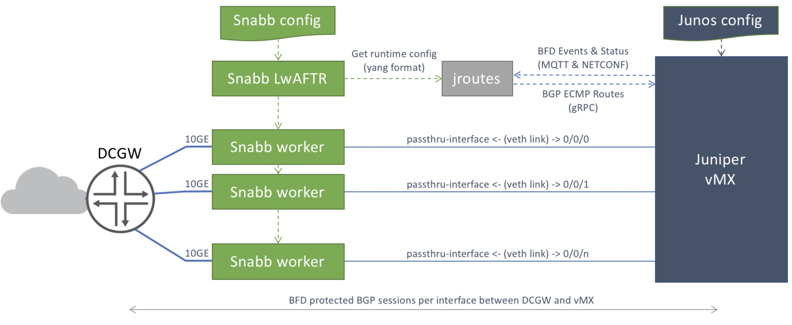

# Juniper Networks vMX Docker lwAftr

 [work in progress ...]

## Overview

Snabb lwAFTR (https://github.com/snabbco/snabb/tree/master/src/program/lwaftr/doc) implements Lightweight 4-over-6 (lw4o6) as an IPv6 transition mechanism according to [RFC 7596](https://tools.ietf.org/html/rfc7596).

A Snabb master process manages one or more snabb worker process based on configuration and can handle any number of 10GE (Intel 82599) based interfaces.

Juniper vMX runs in a Docker Container [OpenJNPR-Container-vMX](https://github.com/Juniper/OpenJNPR-Container-vMX) and maintains BFD protected BGP sessions between Datacenter Gateway (DCGW) router thru the Snabb worker instances via their passthru-interface configuration. 

The [jroutes](https://github.com/mwiget/vmx-docker-lwaftr/tree/micro-service/jroutes) containerized application registers via MQTT for BFD Events and establishes a gRPC based connection to BGP on the vMX. Any event triggers a runtime configuration dump from Snabb LwAFTR, extracts the interface and binding table IPv4 and IPv6 addresses and generates route aggregates with validated next-hop addresses. The validation is done by querying the BFD state table via NETCONF from vMX and disqualify next-hops on subnets with failed BFD sessions (Status Down).

For the legacy vmx-docker-lwaftr solution consult the Juniper White Paper on [vMX Lightweight 4over6 Virtual Network Function](https://www.juniper.net/assets/us/en/local/pdf/whitepapers/2000648-en.pdf) for a solution overview and listen to the podcast on Software Gone Wild by Ivan Pepelnjak, Dec 2016: [Blog](http://blog.ipspace.net/2016/12/snabb-switch-with-vmx-control-plane-on.html), [MP3](http://stream.ipspace.net/nuggets/podcast/Show_68-lwAFTR_Snabb_Data_Plane_with_vMX_Control_Plane.mp3).

