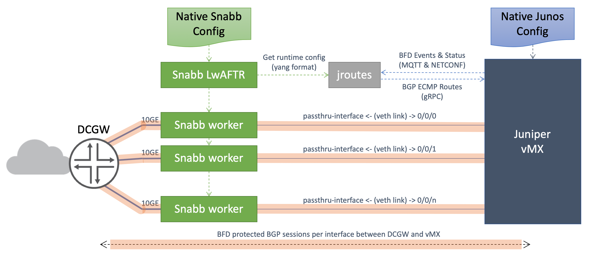

# Juniper Networks vMX Docker lwAftr

[](https://travis-ci.org/mwiget/vmx-docker-lwaftr) [work in progress ...]

## Overview




Snabb lwAFTR (https://github.com/snabbco/snabb/tree/master/src/program/lwaftr/doc) implements Lightweight 4-over-6 (lw4o6) as an IPv6 transition mechanism according to [RFC 7596](https://tools.ietf.org/html/rfc7596).

A Snabb master process manages one or more snabb worker process based on configuration and can handle any number of 10GE (Intel 82599) based interfaces.

Juniper vMX runs in a Docker Container [OpenJNPR-Container-vMX](https://github.com/Juniper/OpenJNPR-Container-vMX) and maintains BFD protected BGP sessions between Datacenter Gateway (DCGW) router thru the Snabb worker instances via their passthru-interface configuration. 

The [jroutes](https://github.com/mwiget/vmx-docker-lwaftr/tree/micro-service/jroutes) containerized application registers via MQTT for BFD Events and establishes a gRPC based connection to BGP on the vMX. Any event triggers a runtime configuration dump from Snabb LwAFTR, exracts the interface and binding table IPv4 and IPv6 addresses and generates route aggregates with validated next-hop addresses. The validation is done by querying the BFD state table from vMX and disqualify next-hops on subnets with failed BFD sessions (Status Down).

For the legacy vmx-docker-lwaftr solution consult the Juniper White Paper on [vMX Lightweight 4over6 Virtual Network Function](https://www.juniper.net/assets/us/en/local/pdf/whitepapers/2000648-en.pdf) for a solution overview and listen to the podcast on Software Gone Wild by Ivan Pepelnjak, Dec 2016: [Blog](http://blog.ipspace.net/2016/12/snabb-switch-with-vmx-control-plane-on.html), [MP3](http://stream.ipspace.net/nuggets/podcast/Show_68-lwAFTR_Snabb_Data_Plane_with_vMX_Control_Plane.mp3).

## Requirements

- [Juniper vMX 18.3 or newer](http://www.juniper.net/support/downloads/?p=vmx)
- Linux kernel 3.13.0+, e.g. as part of Ubuntu 14.04+ or any other Linux distribution
- [Docker Engine 1.12.0+](https://docs.docker.com/engine/installation/) or newer
- [Docker Compose 1.14.0 ](https://docs.docker.com/compose/install/) or newer
- make (install this e.g. via sudo apt-get make)
- Hugepages activated (2M or 1GB size are fine)
- Kernel modules loaded: kvm, loop

## Build instructions


### Clone repo

[wip] until a 1.2.0 tag is set, clone branch passtrhu from mwiget instead of Juniper.

```
git clone -b micro-service https://github.com/mwiget/vmx-docker-lwaftr
```

Or to clone a specific version by tag, use git option '-b' to specify a specific tag:

```
git clone -b v1.2.0 https://github.com/juniper/vmx-docker-lwaftr
```

### Install docker-compose

Check if your compute node has docker-compose 1.14.0 or newer installed:

```
$ docker-compose --version
docker-compose version 1.14.0, build c7bdf9e
```

Otherwise download it:

```
$ sudo su -
# curl -L https://github.com/docker/compose/releases/download/1.14.0/docker-compose-`uname -s`-`uname -m` > /usr/local/bin/docker-compose
# chmod a+rx /usr/local/bin/docker-compose
# exit
$ docker-compose --version
docker-compose version 1.14.0, build c7bdf9e
```

### Build Containers

The build process is now managed via the [docker-compose.yml](docker-compose.yml) file. 
In addition, a [Makefile](Makefile) is also provided to drive the various docker-compose tools
with make, but its use is optional.

```
docker-compose build
```

This will take several minutes and requires Internet access. Alternatively, use 'make build'.

Container dcgw is only needed for functional testing in lack of a physical DCGW.

Use 'docker-compose images' to show the various containers built:


```
$ docker-compose images
          Container                        Repository               Tag       Image Id      Size
--------------------------------------------------------------------------------------------------
dcgw                             juniper/openjnpr-container-vmx    bionic   41e82d83ef01   418 MB
packetblaster                    vmx-docker-lwaftr_packetblaster   latest   2506278f7409   12.4 MB
vmx-docker-lwaftr_jroutes_1      vmx-docker-lwaftr_jroutes         latest   503a22151c65   19.4 MB
vmx-docker-lwaftr_veth-links_1   vmx-docker-lwaftr_veth-links      latest   9a67c9c16d53   6.88 MB
vmx1                             juniper/openjnpr-container-vmx    bionic   41e82d83ef01   418 MB
```

| Container Image | Description |
|---|--|
| vmxdockerlwaftr_lwaftr_1 | Main container to launch Junos vMX image |
| vmxdockerlwaftr_packetblaster_1 | Generates low PPS traffic into xe-0/0/0 over linux bridges |
| vmxdockerlwaftr_b4cpe_1 | B4 test client for one subscriber connected to xe-0/0/1 |
| vmxdockerlwaftr_server_1 | Test server for the B4 client to ping and query via http at 1.1.1.1 |

### 

### Install hugepages

Edit file /etc/default/grub and update the kernel option line:

```
GRUB_CMDLINE_LINUX_DEFAULT="nomodeset hugepages=6000 intel_iommu=off"
$ sudo update-grub
$ sudo reboot
```

Default hugepage size is 2M, so 6000 reserves 12GB of RAM. Make sure the reservation doesn't exceed the system's memory. Then reboot the system.

Check if the hugepages are allocated properly:

```
$ cat /proc/meminfo |grep Huge
AnonHugePages:    903168 kB
ShmemHugePages:        0 kB
HugePages_Total:    6000
HugePages_Free:     5982
HugePages_Rsvd:        0
HugePages_Surp:        0
Hugepagesize:       2048 kB
```

### Kernel modules

Check if the loop mount kernel module is loaded and load it otherwise:
```
$ lsmod|grep loop
mwiget@sb:~$ sudo modprobe loop
mwiget@sb:~$ lsmod|grep loop
loop                   28672  0
```

Do the same for the kvm_intel kernel module:

```
$ lsmod|grep kvm
kvm_intel             192512  3
kvm                   589824  1 kvm_intel
irqbypass              16384  1 kvm
```

To make both changes permanent, add the modules to /etc/modules:

```
$ cat /etc/modules
# /etc/modules: kernel modules to load at boot time.
#
# This file contains the names of kernel modules that should be loaded
# at boot time, one per line. Lines beginning with "#" are ignored.
loop
kvm_intel
```

## Deploy

Before launching it, you need provide the Junos qcow2 image from the vmx-bundle tar file, a license key and a ssh public key to access the instance once running.
Place these three files into the top directory of the cloned repo.

### Download and extract junos*qcow2

Download vMX 18.3 or newer from Juniper, then extract the junos*qcow2 Junos image. Nothing else is required. The forwarding engine will be downloaded from the control plane automatically. 

```
$ tar zxf vmx-bundle-18.3R1.9.tgz
$ mv vmx/images/junos-vmx-x86-64-18.3R1.9.qcow2 .
$ rm -rf vmx
$ ls -l junos-vmx-x86-64-18.3R1.9.qcow2
-rw-r--r-- 1 mwiget mwiget 1377239040 Nov 14 18:07 junos-vmx-x86-64-18.3R1.9.qcow2
```

### Download license key

Download the [vMX eval license key from Juniper](https://www.juniper.net/us/en/dm/free-vmx-trial/):

```
$ wget  https://www.juniper.net/us/en/dm/free-vmx-trial/E421992502.txt
--2017-07-16 16:05:40--  https://www.juniper.net/us/en/dm/free-vmx-trial/E421992502.txt
Resolving www.juniper.net (www.juniper.net)... 2a02:26f0:78:198::720, 2a02:26f0:78:181::720, 95.101.252.154
Connecting to www.juniper.net (www.juniper.net)|2a02:26f0:78:198::720|:443... connected.
HTTP request sent, awaiting response... 200 OK
Length: 206 [text/plain]
Saving to: ‘E421992502.txt’

E421992502.txt            100%[==================================>]     206  --.-KB/s    in 0s

2017-07-16 16:05:40 (359 MB/s) - ‘E421992502.txt’ saved [206/206]

$ mv E421992502.txt license-eval.txt
```

If you have a production key, use that one instead and adjust the license key file name in the [docker-compose.yml](docker-compose.yml) file.

### Copy your ssh public key

Each instance will create a random root password, accessible via 'docker logs <instance-id>'. To access the instance via ssh public/private key, copy your ssh public key file to the repo root directory:

```
$ cp ~/.ssh/id_rsa.pub .
```

### Launch instance

The launch of the instance is done via 'docker-compose up -d'. The option '-d' is needed to launch the instance in the background. The use of 'make up' is a shorter version to type, but uses the same command. It builds the container image again if needed too.

Check the content of [docker-compose.yml](docker-compose.yml) to understand what exactly gets built and launched. It serves as an example and will need adjustment. "out-of-the-box" it launches one lwaftr (vMX) instance, a packetblaster traffic generator for 60k subscribers into 0/0/0 and a b4cpe client, which can be used to interactively test the functionality via 0/0/1 by pinging and connecting to 1.1.1.1 via HTTP.

```
$
```

## Generate binding table

The following command generates a binding table with 6300 entries for shared
IPv4 adddresses 192.0.2.1 thru 192.0.2.100 (from address block reserved for documentation, RFC 5737).

```
$ sudo snabb/src/snabb lwaftr generate-configuration --output lw.conf 192.0.2.1 100 fc00::100 2001:db8::1 6
$ grep psid lw.conf |wc -l
63000
```
